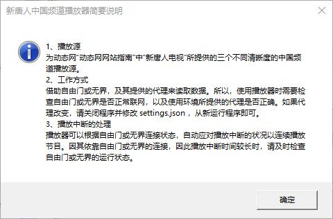

# 新唐人中國頻道播放器

## 一、功能簡介

程式主要是解決自由門限製版使用網頁播放器播放“新唐人電視”（如：動態網頁面內“動態網網站指南”中）所提供的三個不同清晰度的中國頻道時，出現空白無法播放以及網路不佳時連續播放操作繁瑣等問題。程式可以根據自由門或無界連接狀態，自動應對播放中斷狀況以保持連續播放。

程式採用的視頻源，與動態網“動態網網站指南”中“新唐人電視”所提供的三個清晰度的中國頻道播放源相同。

程式需要借助自由門或無界，及其提供的代理來提供視頻資料。也就是說，本程式只是輔助播放工具，因此使用播放器時，需要使用者自己關注和檢查自由門或無界代理是否正确，及其運行狀態。播放過程中，特別是播放中斷時間較長時，需要及時檢查自由門或無界的運行狀態，包括聯網狀況。

如果在不同環境下，自由門或無界所指向的代理的IP或端口發生變化，請關閉程式，修改 settings.json相應的參數後，再從新運行程式。

本播放器在中國大陸可以用於輔助播放中國新年期間的神韻晚會和音樂會。

 
## 二、開發環境等

|  類別  |說明|
| :---   | :---        |
|開發工具	|VS2022 社區版|
|語言|C#|
|DotNet|8.0|
|Nuget引用庫|Dragablz, Flyleaf.FFmpeg.Bindings, MaterialDesignThemes, Newtonsoft.Json, Vortice.D3Dcompiler, Vortice.Direct3D11, Vortice.DirectComposition, Vortice.Mathematics, Vortice.MediaFoundation, Vortice.Xaudio2, wpfColorFontDialog|
|添加且修改的專案|	Flyleaf-3.8.2（https://github.com/SuRGeoNix/Flyleaf），因原始程式碼需要修改才能使用，所以將其引入，做了代碼簡化，以及少量和必要的改動。|

程式調試時，需要參考“三、使用前的準備”中第2部分，將ffmpeg相關的8個dll檔放在所生成可執行程序位置的\FFmpeg目錄下。發佈程式時，需要把FFmpeg目錄及檔複製於與主程序同一位置。

## 三、使用前的準備

使用前程式需要做好的準備： 

1、安裝微軟net Core8的桌上出版程式運行時，下載位址：
https://download.visualstudio.microsoft.com/download/pr/f18288f6-1732-415b-b577-7fb46510479a/a98239f751a7aed31bc4aa12f348a9bf/windowsdesktop-runtime-8.0.1-win-x64.exe

2、下載ffmpeg相關檔（用於播放視頻）
下載 https://www.gyan.dev/ffmpeg/builds/packages/ffmpeg-7.1.1-full_build-shared.7z ，解壓後，複製其 bin 目錄下除了exe檔之外的所有dll檔至程式的FFMpeg目錄下。

## 四、使用簡要說明

1、初始使用，會顯示播放源等重要資訊。

2、程式版本資訊，把滑鼠放在左上角的新唐人電視臺標“唐”上即可看到。

3、提供視頻品質和寬高比選擇。

4、視頻品質選擇。

5、視頻寬高比選擇。
因為一些老的節目，如《我們告訴未來》等是4:3的寬高比，人、物比例按照目前的比例是變形的，所以需要臨時調整。

6、出現播放錯誤，會自動對自由門或無界提供的連接狀態進行檢測，以保持連續播放。

## 五、所使用或引用的專案

1、Flyleaf
https://github.com/SuRGeoNix/Flyleaf

2、ffmpeg
https://github.com/BtbN/FFmpeg-Builds/releases

### 誠心感謝作者的付出！

## 六、更新

【20250322】
更新 Flyleaf 版本至 V3.8.2。

